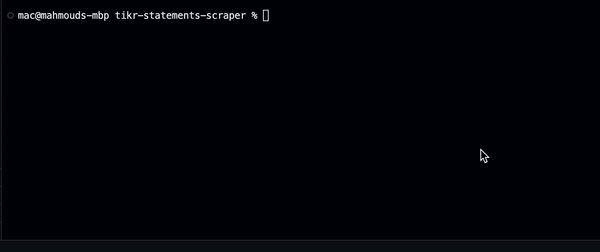

# TIKR Financial Statements Scraper
A tool to scrape historical financial statements of companies from TIKR website and have them listed in an excel spreadsheet for a quicker analysis and market research.

## Introduction
TIKR among the best sites that provide tools for Stock Market Research and Investor Analysis. It has a terminal where users can look for historical financial statements. The purpose of this tool is to have offline copies of the required statements in an easy-to-use spreadsheet that allows investors to make analysis quicker and use their custom formulae easily on the statements tables.

## Installation & Usage

### Pre-requisites:
- Python 3.x (Download: https://www.python.org/downloads/)
- Libraries (`pip3 install -r requirements.txt`)

#### Python Package Requirements
The following packages are required (as listed in `requirements.txt`):

```
pandas==2.2.3
numpy==2.2.0
requests==2.26.0
selenium==4.7.2
selenium_wire==5.1.0
webdriver_manager==3.5.1
xlsxwriter==3.1.9
blinker==1.6.3
```

### Set up:
- Clone the repository (`git clone https://github.com/membaby/tikr-statements-scraper`)
- Update `config.py` file with your TIKR account credentials.

### Usage:
- Run `python3 TIKR.py` (`python TIKR.py` on Windows)
- Enter the company name (eg. `Apple`) or stock ticker symbol (eg. `AAPL`)

## Overview

### Scraping Process
1. User enters company name or stock ticker symbol.
2. Script generates access token and stores it locally in `token.tmp` for quicker scraping in case multiple companies financial statements are required.
3. Script uses the generated access token to fetch the historical statements of desired company.
4. Script creates a new excel spreadsheet.

### Steps Visualization


### Data 
Please refer to `./sample-outputs/` folder for data samples.

1. Income Statements
```
Revenues
Total Revenues
Total Revenues YoY
Cost of Goods Sold
Gross Profit
Gross Profit YoY
% Gross Margins
Selling General & Admin Expenses
R&D Expenses
Total Operating Expenses
Operating Income
Operating Income YoY
% Operating Margins
Interest Expense
Interest And Investment Income
Currency Exchange Gains (Loss)
Other Non Operating Income (Expenses)
EBT Excl. Unusual Items
Gain (Loss) On Sale Of Investments
Gain (Loss) On Sale Of Assets
Asset Writedown
In Process R&D Expenses
Legal Settlements
Other Unusual Items
EBT Incl. Unusual Items
Income Tax Expense
Earnings From Continuing Operations
Earnings Of Discontinued Operations
Net Income to Company
Net Income
Net Income to Common Incl Extra Items
% Net Income to Common Incl Extra Items Margins
Net Income to Common Excl. Extra Items
% Net Income to Common Excl. Extra Items Margins
Diluted EPS Excl Extra Items
Diluted EPS Excl Extra Items YoY
Weighted Average Diluted Shares Outstanding
Weighted Average Diluted Shares Outstanding YoY
Weighted Average Basic Shares Outstanding
Weighted Average Basic Shares Outstanding YoY
Basic EPS
EBITDA
EBITDA YoY
EBITDAR
R&D Expense
Selling and Marketing Expense
General and Administrative Expense
Effective Tax Rate %
```

2. Cashflow Statements
```
Net Income
Depreciation & Amortization
Amortization of Goodwill and Intangible Assets
Total Depreciation & Amortization
(Gain) Loss From Sale Of Asset
(Gain) Loss on Sale of Investments
Asset Writedown & Restructuring Costs
Stock-Based Compensation
Tax Benefit from Stock Options
Net Cash From Discontinued Operations
Other Operating Activities
Change In Accounts Receivable
Change In Inventories
Change In Accounts Payable
Change in Unearned Revenues
Change In Income Taxes
Change in Other Net Operating Assets
Cash from Operations
Change in Net Working Capital
Capital Expenditure
Sale of Property, Plant, and Equipment
Cash Acquisitions
Divestitures
Sale (Purchase) of Intangible assets
Investment in Marketable and Equity Securities
Other Investing Activities
Cash from Investing
Total Debt Issued
Total Debt Repaid
Issuance of Common Stock
Repurchase of Common Stock
Other Financing Activities
Cash from Financing
Foreign Exchange Rate Adjustments
Net Change in Cash
Free Cash Flow
Free Cash Flow YoY
% Free Cash Flow Margins
Cash and Cash Equivalents, Beginning of Period
Cash and Cash Equivalents, End of Period
Cash Interest Paid
Cash Taxes Paid
Cash Flow per Share
```

3. Balance Sheet Statements
```
Cash And Equivalents
Short Term Investments 
Total Cash And Short Term Investments 
Accounts Receivable
Other Receivables 
Notes Receivable
Total Receivables
Inventory 
Prepaid Expenses
Deferred Tax Assets Current
Restricted Cash
Other Current Assets 
Total Current Assets 
Gross Property Plant And Equipment
Accumulated Depreciation
Net Property Plant And Equipment 
Long-term Investments 
Goodwill
Other Intangibles
Loans Receivable Long-Term 
Deferred Tax Assets Long-Term 
Other Long-Term Assets 
Total Assets 
Accounts Payable
Accrued Expenses
Short-term Borrowings 
Current Portion of Long-Term Debt
Current Portion of Capital Lease Obligations
Current Income Taxes Payable 
Unearned Revenue Current 
Other Current Liabilities 
Total Current Liabilities 
Long-Term Debt 
Capital Leases
Unearned Revenue Non Current
Deferred Tax Liability Non Current 
Other Non Current Liabilities 
Total Liabilities 
Preferred Stock Convertible 
Preferred Stock - Others 
Total Preferred Equity 
Common Stock
Additional Paid In Capital
Retained Earnings
Comprehensive Income and Other 
Total Common Equity 
Total Equity 
Total Liabilities And Equity 
Total Shares Out. on Filing Date 
Book Value/Share 
Tangible Book Value
Tangible Book Value/Share 
Total Debt 
Net Debt
Equity Method Investments 
Land 
Buildings 
Construction In Progress 
Full Time Employees
```

## Notes
This software uses TIKR platform to fetch the data. It requires a paid membership in order to extract all historical data, although a free membership would work with restrictions. Find more information on [TIKR website](https://www.tikr.com).

# ClickHouse Database for Stock Data

## Why ClickHouse?
ClickHouse is a high-performance, open-source columnar database management system well-suited for analytical workloads and large time-series datasets, such as 20+ years of stock data.

## Schema Design

### 1. Company Metadata Table
Stores static or slowly-changing company info (from yfinance and enrich_with_exchange.py).

```sql
CREATE TABLE stockdb.companies
(
    symbol String,
    shortName String,
    longName String,
    displayName String,
    language String,
    region String,
    exchange String,
    fullExchangeName String,
    market String,
    quoteType String,
    typeDisp String,
    exchangeTimezoneName String,
    exchangeTimezoneShortName String,
    gmtOffSetMilliseconds Int64,
    marketState String,
    messageBoardId String,
    quoteSourceName String,
    triggerable UInt8,
    customPriceAlertConfidence Float32,
    hasPrePostMarketData UInt8,
    firstTradeDateMilliseconds Int64,
    address1 String,
    city String,
    state String,
    zip String,
    country String,
    phone String,
    website String,
    industry String,
    industryKey String,
    industryDisp String,
    sector String,
    sectorKey String,
    sectorDisp String,
    category String,
    fundFamily String,
    legalType String,
    longBusinessSummary String,
    fullTimeEmployees Int32,
    -- ... (add all other YF_FIELDS as needed)
    PRIMARY KEY (symbol)
) ENGINE = MergeTree();
```

### 2. Financials Table (Time Series)
Stores all yearly (or quarterly) values for each company, for all keys in keys.py.

```sql
CREATE TABLE stockdb.financials
(
    symbol String,
    statement String,         -- e.g. 'income_statement', 'cashflow_statement', 'balancesheet_statement'
    fiscal_year UInt16,
    fiscal_period String,     -- e.g. 'FY', 'Q1', 'Q2', etc. (if you want quarterly granularity)
    key String,               -- e.g. 'Net Income', 'Revenues', etc.
    value Float64,
    currency String DEFAULT 'USD',
    updated_at DateTime DEFAULT now(),
    PRIMARY KEY (symbol, statement, fiscal_year, key)
) ENGINE = MergeTree()
ORDER BY (symbol, statement, fiscal_year, key);
```
- This is a "long" format: each row is one value for one key, one year, one company.
- You can also use a "wide" format (one row per year per company, with all keys as columns), but "long" is more flexible for analytics and schema changes.

### 3. (Optional) Prices Table
If you want to store daily/ohlc stock prices:

```sql
CREATE TABLE stockdb.prices
(
    symbol String,
    date Date,
    open Float64,
    high Float64,
    low Float64,
    close Float64,
    volume UInt64,
    adj_close Float64,
    PRIMARY KEY (symbol, date)
) ENGINE = MergeTree()
ORDER BY (symbol, date);
```

## Loading Data
- Use the ClickHouse `clickhouse-client` or `clickhouse-copier` to bulk insert CSVs.
- You can use Python's `clickhouse-connect` or `clickhouse-driver` to automate inserts from your scripts.

## Schema Evolution
- If you add new keys in `keys.py`, you just insert new rows with new `key` values—no schema migration needed.

## Example Query
Get Net Income for all companies in 2020:

```sql
SELECT symbol, value
FROM stockdb.financials
WHERE key = 'Net Income' AND fiscal_year = 2020
```

## Next Steps
- Install ClickHouse (locally or in the cloud).
- Create the tables above.
- Write a Python script to read your CSVs and insert into ClickHouse.
- (Optional) Set up views or materialized views for common analytics.

If you want a sample Python loader script, let us know!

# PostgreSQL Database for Stock Data

## Why PostgreSQL?
PostgreSQL is a robust, open-source relational database system, ideal for analytics and time-series data. It is widely supported and can be extended with features like TimescaleDB for even better time-series performance.

## Schema Design

### 1. Company Metadata Table
Stores static or slowly-changing company info (from yfinance and enrich_with_exchange.py).

```sql
CREATE TABLE companies (
    symbol TEXT PRIMARY KEY,
    short_name TEXT,
    long_name TEXT,
    display_name TEXT,
    language TEXT,
    region TEXT,
    exchange TEXT,
    full_exchange_name TEXT,
    market TEXT,
    quote_type TEXT,
    type_disp TEXT,
    exchange_timezone_name TEXT,
    exchange_timezone_short_name TEXT,
    gmt_offset_milliseconds BIGINT,
    market_state TEXT,
    message_board_id TEXT,
    quote_source_name TEXT,
    triggerable BOOLEAN,
    custom_price_alert_confidence REAL,
    has_pre_post_market_data BOOLEAN,
    first_trade_date_milliseconds BIGINT,
    address1 TEXT,
    city TEXT,
    state TEXT,
    zip TEXT,
    country TEXT,
    phone TEXT,
    website TEXT,
    industry TEXT,
    industry_key TEXT,
    industry_disp TEXT,
    sector TEXT,
    sector_key TEXT,
    sector_disp TEXT,
    category TEXT,
    fund_family TEXT,
    legal_type TEXT,
    long_business_summary TEXT,
    full_time_employees INTEGER
    -- Add more fields as needed from YF_FIELDS
);
```

### 2. Financials Table (Time Series)
Stores all yearly (or quarterly) values for each company, for all keys in keys.py.

```sql
CREATE TABLE financials (
    id SERIAL PRIMARY KEY,
    symbol TEXT REFERENCES companies(symbol),
    statement TEXT,         -- e.g. 'income_statement', 'cashflow_statement', 'balancesheet_statement'
    fiscal_year INTEGER,
    fiscal_period TEXT,     -- e.g. 'FY', 'Q1', 'Q2', etc. (if you want quarterly granularity)
    key TEXT,               -- e.g. 'Net Income', 'Revenues', etc.
    value DOUBLE PRECISION,
    currency TEXT DEFAULT 'USD',
    updated_at TIMESTAMP DEFAULT CURRENT_TIMESTAMP
);
CREATE INDEX ON financials(symbol, statement, fiscal_year, key);
```

### 3. (Optional) Prices Table
If you want to store daily/ohlc stock prices:

```sql
CREATE TABLE prices (
    id SERIAL PRIMARY KEY,
    symbol TEXT REFERENCES companies(symbol),
    date DATE,
    open DOUBLE PRECISION,
    high DOUBLE PRECISION,
    low DOUBLE PRECISION,
    close DOUBLE PRECISION,
    volume BIGINT,
    adj_close DOUBLE PRECISION
);
CREATE INDEX ON prices(symbol, date);
```

---

## Python Script to Load CSVs into PostgreSQL

Install dependencies:
```bash
pip install psycopg2 pandas
```

Example loader script:
```python
import pandas as pd
import psycopg2
from psycopg2.extras import execute_values

def load_companies(csv_path, conn):
    df = pd.read_csv(csv_path)
    cols = [
        'symbol', 'shortName', 'longName', 'displayName', 'language', 'region', 'exchange',
        'fullExchangeName', 'market', 'quoteType', 'typeDisp', 'exchangeTimezoneName',
        'exchangeTimezoneShortName', 'gmtOffSetMilliseconds', 'marketState', 'messageBoardId',
        'quoteSourceName', 'triggerable', 'customPriceAlertConfidence', 'hasPrePostMarketData',
        'firstTradeDateMilliseconds', 'address1', 'city', 'state', 'zip', 'country', 'phone',
        'website', 'industry', 'industryKey', 'industryDisp', 'sector', 'sectorKey', 'sectorDisp',
        'category', 'fundFamily', 'legalType', 'longBusinessSummary', 'fullTimeEmployees'
    ]
    df = df.rename(columns={c: c.lower() for c in df.columns})
    df = df.where(pd.notnull(df), None)
    tuples = [tuple(x) for x in df[cols].to_numpy()]
    query = f"INSERT INTO companies ({', '.join(cols)}) VALUES %s ON CONFLICT (symbol) DO NOTHING"
    with conn.cursor() as cur:
        execute_values(cur, query, tuples)
    conn.commit()

def load_financials(csv_path, conn):
    df = pd.read_csv(csv_path)
    cols = ['symbol', 'statement', 'fiscal_year', 'fiscal_period', 'key', 'value', 'currency']
    df = df.where(pd.notnull(df), None)
    tuples = [tuple(x) for x in df[cols].to_numpy()]
    query = f"INSERT INTO financials ({', '.join(cols)}) VALUES %s"
    with conn.cursor() as cur:
        execute_values(cur, query, tuples)
    conn.commit()

if __name__ == "__main__":
    conn = psycopg2.connect(
        dbname="your_db", user="your_user", password="your_password", host="localhost", port=5432
    )
    load_companies('marketstack_all_tickers_enriched.csv', conn)
    load_financials('your_financials.csv', conn)
    conn.close()
```
- Adjust column names and file paths as needed.
- For large files, consider chunking the CSVs.

---

## Example Views for Analytics

### 1. View: Net Income by Year
```sql
CREATE OR REPLACE VIEW net_income_by_year AS
SELECT symbol, fiscal_year, value AS net_income
FROM financials
WHERE key = 'Net Income';
```

### 2. View: Revenue Growth by Year
```sql
CREATE OR REPLACE VIEW revenue_growth AS
SELECT symbol, fiscal_year, value AS revenue,
       value - LAG(value) OVER (PARTITION BY symbol ORDER BY fiscal_year) AS revenue_growth
FROM financials
WHERE key = 'Revenues';
```

### 3. Materialized View: Top Companies by Net Income (2020)
```sql
CREATE MATERIALIZED VIEW top_net_income_2020 AS
SELECT symbol, value AS net_income
FROM financials
WHERE key = 'Net Income' AND fiscal_year = 2020
ORDER BY net_income DESC
LIMIT 10;
```

---

If you need more advanced analytics, TimescaleDB, or help with automation, let us know!


VISUALIZATION
++++++++++++++++++

Great vision! Here’s a plan to build a beautiful, interactive web-based stock screener inspired by GuruFocus, powered by your PostgreSQL database:
1. Tech Stack Recommendation
Backend: FastAPI (Python, async, great for APIs, easy to connect to PostgreSQL)
Frontend: React (modern, flexible, beautiful UI with libraries like Material-UI or Ant Design)
Database: PostgreSQL (already set up)
ORM: SQLAlchemy (for flexible queries)
Visualization: Use React DataGrid/Table, charts (e.g., recharts, chart.js), and filters
2. Key Features
Dynamic Query Builder: Users can select any combination of financial/metadata fields, set conditions (>, <, =, contains, etc.), and run queries.
Results Table: Paginated, sortable, filterable, exportable.
Column Picker: Choose which columns to display.
Parameter Presets: Save/load custom screens (like GuruFocus).
Stock Details: Click a row to see detailed financials, charts, and company info.
Responsive Design: Works on desktop and mobile.
3. How It Works
Frontend:
User selects filters/columns (e.g., “P/E < 15”, “Market Cap > $10B”, “Sector = Technology”).
Sends query to backend API.
Displays results in a beautiful, interactive table.
Backend:
Receives query parameters, builds SQL dynamically, fetches results from PostgreSQL, returns JSON.
4. Implementation Steps
A. Backend (FastAPI)
Expose endpoints:
/fields — List all available fields (for building the UI)
/screener — Accepts filter/query params, returns matching stocks
/company/{symbol} — Detailed info for a single company
Use SQLAlchemy to build flexible queries based on user input.
B. Frontend (React)
Build a query builder UI (dropdowns, sliders, text inputs for each field).
Use a DataGrid (e.g., Material-UI DataGrid, AG Grid, or Ant Design Table) for results.
Add column picker, export, and detail modal/page.
Style with Material-UI or Ant Design for a modern look.
5. Next Steps
Set up FastAPI backend with endpoints for querying the database.
Create a new React app with a beautiful UI and connect it to the backend.
Iterate: Add advanced features (presets, charts, etc.).


Frontend
+++++++++
. Frontend Plan (React, Material-UI, DataGrid)
Dynamic Query Builder:
Multi-field filter rows (field, operator, value) with add/remove.
Field dropdowns auto-populated from /fields API.
Operator dropdown adapts to field type (e.g., numeric, text).
Results Table:
Fast, paginated, sortable, filterable.
Column picker to show/hide columns.
Click a row for a modal or page with full company details and financials.
Presets:
Save/load custom screens (localStorage for now).
Modern, responsive design:
Material-UI theme, beautiful spacing, mobile-friendly.
2. Backend
Already supports flexible queries and company details.
If you want more endpoints (e.g., for presets, charts), let me know.
3. Next Steps
I’ll:
Scaffold the main React page with:
Query builder UI (multi-row, add/remove, field/operator/value).
Results table (DataGrid) with column picker.
Company details modal.
Save/load screen presets.
Connect to your FastAPI backend.
4. What you’ll get
A single-page app at http://localhost:3000 that feels like GuruFocus Screener.
You can filter, sort, and explore your database visually and interactively.